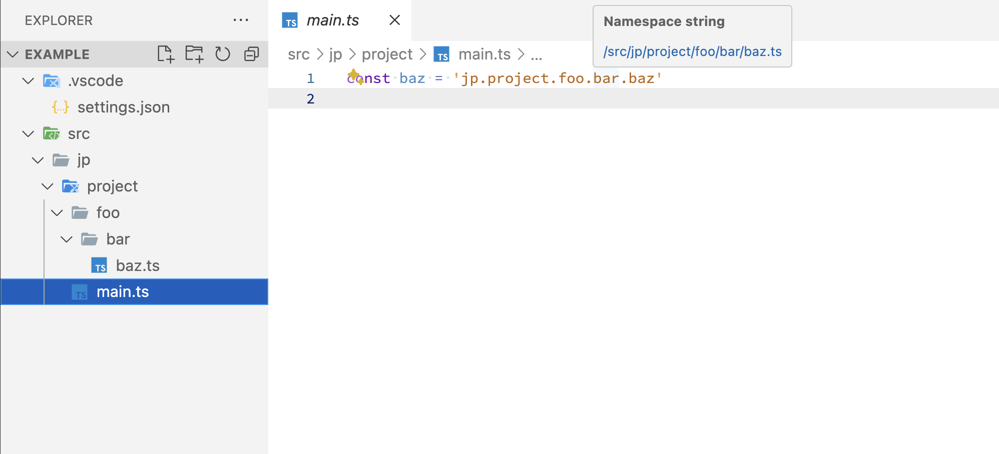

# VSCode Custom Code Jump

VSCode extension to create custom code jump rules.  
You can set code jumps using your own regular expressions.

Created to support products that use string references but are difficult to refactor.

## Usage

1. Install the `Custom Code Jump` extension from the Extensions menu.
1. Add the configuration to your project's `.vscode/settings.json`.  
   The following example creates code jump for the string `'jp.project.foo.bar.baz'` to `src/jp/project/foo/bar/baz.{ts,js}`.

   ```json
   // e.g.
   {
     "customCodeJump.definitions": [
       {
         "languages": ["typescript", "javascript"],
         "pattern": "'jp\\.project\\.(.*?)'",
         "hoverHeader": "Namespace string",
         "rules": [
           {
             "type": "regexp",
             "pattern": "'jp\\.project\\.(.*?)'",
             "replacement": "/src/jp/project/$1"
           },
           {
             "type": "string",
             "pattern": ".",
             "replacement": "/"
           },
           {
             "type": "regexp",
             "pattern": "^(.*?)$",
             "replacement": "$1.{ts,js}"
           }
         ]
       }
     ]
   }
   ```

1. A code jump is created of the target string and a hover tooltip is also added.
   

## Configuration

### `customCodeJump.definitions[]`

| Prop          | Type       | Description                                        | Example                        |
| ------------- | ---------- | -------------------------------------------------- | ------------------------------ |
| `languages`   | `string[]` | Languages of file to enable code jump.             | `["typescript", "javascript"]` |
| `pattern`     | `string`   | RegExp pattern for strings that create code jumps. | `"'jp\\.project\\.(.*?)'"`     |
| `rules`       | `array`    | Array of replacement rules. See `rules[]`.         |                                |
| `hoverHeader` | `string`   | Header text in hover tooltip. (Optional)           | "Namespace string"             |

#### `rules[]`

| Prop          | Type                   | Description                            | Example                    |
| ------------- | ---------------------- | -------------------------------------- | -------------------------- |
| `type`        | `'string' \| 'regexp'` | Replacement type.                      | `'string'` or `'regexp'`   |
| `pattern`     | `string`               | String pattern to use for replacement. | `"'jp\\.project\\.(.*?)'"` |
| `replacement` | `string`               | String pattern after replacement.      | `"/src/jp/project/$1"`     |

## Contributing

Please create an [Issue](https://github.com/kimulaco/vscode-custom-code-jump/issues) or [Pull requests](https://github.com/kimulaco/vscode-custom-code-jump/pulls) if you have any improvements!

## License

[MIT License](./LICENSE)
